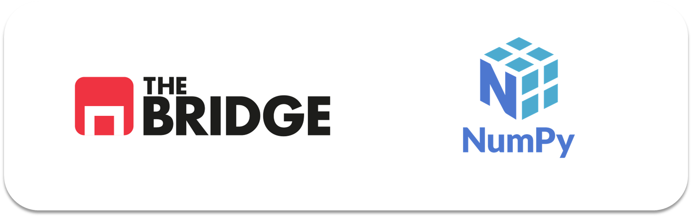

# 📘 Sprint 03 · Unidad 01

## NumPy y Módulos en Python

En esta unidad se introducen dos conceptos clave para el desarrollo en Python: el cálculo numérico eficiente con **NumPy** y la organización del código mediante **módulos**.

---

## 📂 Contenido de la teoria

---

### 📄 1. NumPy

🔗 [Abrir notebook](./numpy.ipynb)

Este notebook introduce NumPy como la librería fundamental para el cálculo numérico y la manipulación eficiente de datos en Python.

**¿Qué aprenderás?**

* Creación y manipulación de arrays (`ndarray`)
* Diferencias entre listas y arrays
* Indexado, slicing y filtrado (1D y 2D)
* Operaciones vectorizadas y matemáticas básicas
* Estadística básica y uso de `axis`

---

### ⚙️ 2. Módulos en Python

🔗 [Abrir archivo](./modulos_python.md)

Este documento explica cómo estructurar proyectos en Python mediante módulos reutilizables.

**¿Qué aprenderás?**

* Creación de scripts y módulos `.py`
* Importación de funciones y paquetes
* Uso de `if __name__ == "__main__"`
* Reutilización de código entre archivos
* Buenas prácticas de organización y documentación
