## Introducción a HTTP

HTTP (*HyperText Transfer Protocol*) es el protocolo más común para la comunicación **cliente → servidor** en la web.  
En la práctica, HTTP casi siempre va **encima de TCP** (*Transmission Control Protocol*) y **IP** (*Internet Protocol*): primero tu equipo establece una **sesión TCP** fiable con el servidor (puerto típico **80** en HTTP claro, **443** en HTTPS); si la URL es `https://`, dentro de esa conexión TCP se negocia **TLS** y el HTTP viaja **cifrado**. Más abajo se resume la pila **TCP/IP** y ese orden.

Pero para entenderlo bien, conviene primero situar **qué es Internet**, **cómo encaja HTTP**, **por qué existe HTTPS** (*HTTP Secure*, HTTP sobre cifrado; en la práctica usando **TLS**, *Transport Layer Security*) y **cómo se relaciona con APIs**. El término **SSL** (*Secure Sockets Layer*) es el antecedente histórico: aún se oye “SSL”, pero el estándar actual es **TLS**.

---

## ¿Cómo navegamos por Internet?
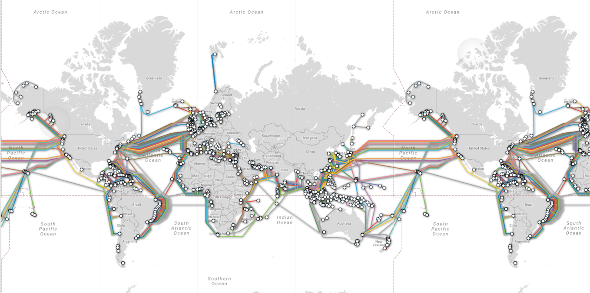


- [How the Internet Works in 5 Minutes](https://www.youtube.com/watch?v=7_LPdttKXPc)

Ideas clave:

- Internet es la **red de redes**: muchas redes independientes interconectadas.
- Intervienen muchos factores (**ISP**, *Internet Service Provider*: proveedor de acceso a Internet; **DNS**, *Domain Name System*: sistema que traduce nombres de dominio a direcciones IP; routers; **CDN**, *Content Delivery Network*: red que sirve copias del contenido desde nodos cercanos al usuario; centros de datos, protocolos…).
- En la base práctica, tu ordenador (**cliente**) se comunica con otro ordenador (**servidor**).
- La conversación suele ser **por pasos**: **petición** y **respuesta**.

En la práctica, cada vez que cargas una página o tu código llama a una URL, alguien **pide** un recurso y el servidor **contesta** (HTML, JSON, imágenes, etc.). Los factores anteriores son “etapas del camino”: el **DNS** resuelve el nombre del host; una **CDN** (si entra en juego) acerca el contenido al usuario; tu **ISP** te conecta a Internet. No necesitas dominar cada capa para usar HTTP en la unidad, pero sí tener claro el par **petición → respuesta**.

**Partes de una comunicación HTTP típica**

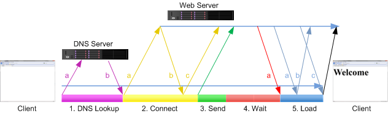

### TCP/IP: qué ocurre por debajo de HTTP

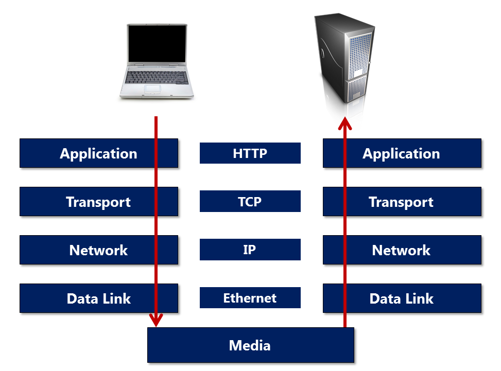

**TCP/IP** no es un solo protocolo: es el conjunto de reglas que hace que Internet funcione en **capas** (a veces se enseña como pila de **4 capas** o con el **modelo OSI**; aquí basta la idea).

- **IP** (*Internet Protocol*, capa de red): lleva **paquetes** entre **direcciones IP** (cada host alcanzable tiene una; el **DNS** traduce nombres como `api.ejemplo.com` a una IP). IP **enruta** el tráfico por la red; no garantiza por sí solo que todo llegue ordenado y sin pérdidas.
- **TCP** (*Transmission Control Protocol*, capa de transporte): abre entre cliente y servidor una **conexión fiable** (flujo de bytes con acuses de recibo y reenvíos si hace falta). **HTTP (y TLS) usan TCP** en el caso típico: los mensajes HTTP son bytes que se escriben y leen por esa conexión.
- **HTTP** (capa de aplicación): define el **formato** de peticiones y respuestas (método, ruta, cabeceras, cuerpo, códigos…). Tu navegador o `requests` monta el HTTP; el SO y la pila de red lo transportan con TCP/IP.

**Secuencia habitual con `https://host/...`:** (1) **DNS** → IP del `host`; (2) **TCP** → conexión a `IP:443` (puerto por defecto de HTTPS); (3) **TLS** → acuerdo de cifrado y confianza sobre esa TCP; (4) **HTTP** → petición y respuesta **dentro** del túnel TLS. Con `http://` suele usarse el puerto **80** y no hay capa TLS (el HTTP va legible en la red; hoy es poco aceptable en producción).

### Recursos

- [How Does the Internet Actually Work?](https://www.youtube.com/watch?v=bjrDGZvpkDI)
- [Inside a Google data center](https://www.youtube.com/watch?v=XZmGGAbHqa0)
- [La HISTORIA de INTERNET #DiaDeInternet - Drawing Things](https://www.youtube.com/watch?v=mGG5o6vbKyQ)
- [How It Works: Internet of Things](https://www.youtube.com/watch?v=QSIPNhOiMoE)

---

## El sistema DNS (*Domain Name System*)

El **DNS** es el servicio distribuido que responde a la pregunta: “¿qué **dirección IP** (u otro dato) corresponde a este **nombre** (`www.ejemplo.com`, `api.ejemplo.com`, …)?”. Sin DNS tendrías que acordarte de números IP para cada sitio; con DNS trabajas con **nombres jerárquicos** delegados en **zonas**.

### Cómo se organizan los nombres en el árbol DNS

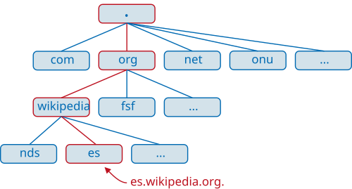

Los nombres se leen de **derecha a izquierda** en niveles separados por puntos:

1. **Raíz** (suele escribirse como un punto final implícito `.`): el árbol global de Internet parte de la raíz; los **servidores raíz** conocen qué servidores responden por cada **TLD** (*Top Level Domain*, dominio de primer nivel).
2. **TLD**: el tramo más a la derecha del “nombre registrable” (p. ej. **`.com`**, **`.org`**, **`.es`**, **`.dev`**).  
   - Los **ccTLD** (*country-code TLD*, p. ej. **`.es`**, **`.mx`**, **`.de`**) suelen ligarse a un **país o territorio** en su política de registro (quién puede registrar, requisitos, etc.), pero **sigue siendo una etiqueta en el árbol DNS**, no una división geográfica del tráfico por sí sola.  
   - Los **gTLD** genéricos (`.com`, `.net`, …) no implican una región concreta.
3. **Dominio de segundo nivel** (dominio “de marca”): lo que contratas en un **registrar** (p. ej. `ejemplo` en `ejemplo.com`).
4. **Subdominios** (tercer nivel y sucesivos): los crea quien controla la zona (`www`, `api`, `cdn`, `mail`, …). Pueden apuntar a **IPs distintas** o a otros nombres (**`CNAME`**, etc.).

**Delegación:** quien controla una zona (p. ej. `ejemplo.com`) configura en sus **servidores DNS autoritativos** los registros de `ejemplo.com` y de sus subdominios, y “delega” en los TLD la información de **quién es autoritativo** para esa rama del árbol. Así el sistema escala: nadie tiene una única base de datos central con todos los nombres.

### Resolución: recursivo frente a autoritativo

- **Cliente** (tu PC, el móvil…): normalmente **no** pregunta directamente a los servidores raíz; le basta con hablar con un **resolver recursivo** (a menudo el de tu **ISP**, o públicos como **8.8.8.8** / **1.1.1.1**). Ese resolver hace las consultas encadenadas por ti y **cachea** respuestas un tiempo (**TTL**, *time to live*).
- **Servidores autoritativos**: son la “fuente de verdad” **para una zona** concreta (p. ej. los que aloja tu proveedor DNS o tu empresa). Devuelven registros del tipo **A** / **AAAA** (IPv4 / IPv6), **CNAME** (alias a otro nombre), **MX** (correo), **TXT** (texto, verificaciones, SPF…), etc.

Flujo resumido: **tu aplicación necesita la IP del host** → el SO pregunta al **resolver** → el resolver recorre (si hace falta) **raíz → TLD → autoritativo del dominio** → obtiene la respuesta → te la entrega → ya puedes abrir **TCP** hacia esa IP.

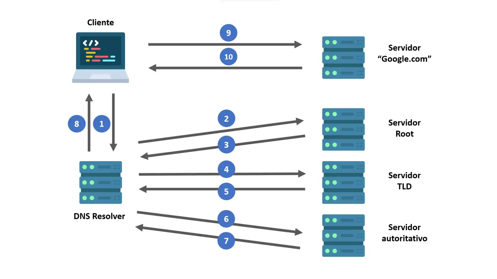
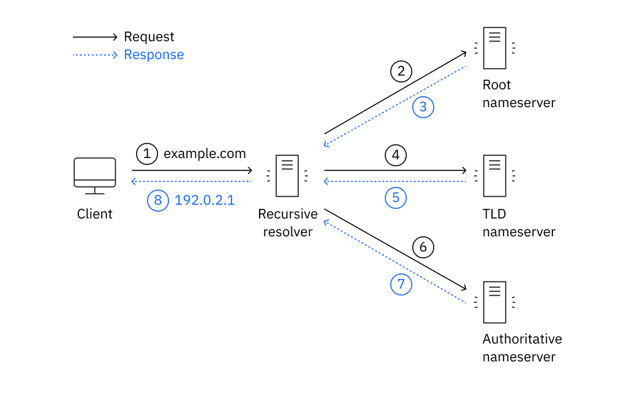

### Regiones DNS en la práctica (sin confundir con el árbol de nombres)

- Lo **jerárquico** es el **nombre** (raíz → TLD → dominio → subdominio), no “primero Europa y luego Asia”.
- Aun así, en el mundo real los operadores reparten **instancias** de los mismos servicios lógicos por el planeta: muchos nodos críticos (p. ej. raíz o grandes DNS públicos) usan **anycast** (la misma dirección IP anunciada desde varios sitios): te contesta el nodo **topológicamente cercano**, bajando latencia y mejorando tolerancia a fallos. Es **distribución en red**, no una carpeta “por continentes” dentro del protocolo.
- Las **CDN** (tema aparte) sí suelen elegir **edge** por proximidad geográfica; el DNS puede devolver IPs distintas según políticas (**DNS geográfico** / balanceo), pero eso ya es **configuración del dueño del dominio**, no una regla fija del DNS.

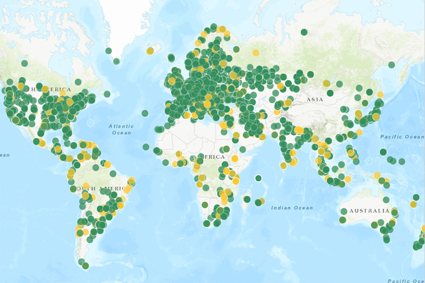


### Recursos

- [How DNS Works (videos/explicación visual, inglés)](https://howdns.works/)
- [DNS en Wikipedia (es)](https://es.wikipedia.org/wiki/Sistema_de_nombres_de_dominio)
- [Zonas DNS (Wikipedia, es)](https://es.wikipedia.org/wiki/Zona_DNS)
- [MDN — Cómo funciona el DNS](https://developer.mozilla.org/es/docs/Learn_web_development/Howto/Web_mechanics/What_is_a_domain_name#c%C3%B3mo_funciona_realmente_un_nombre_de_dominio)

---

## HTTP/2

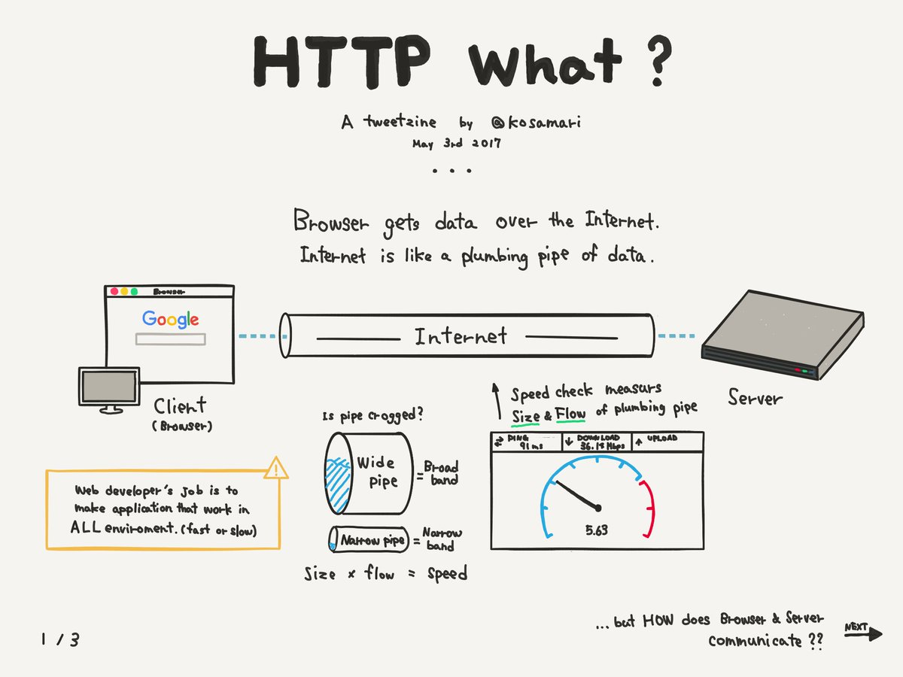

HTTP/2 es una evolución del protocolo HTTP pensada para mejorar el rendimiento (sobre todo en navegadores) frente a HTTP/1.1.

Con **HTTP/1.1** era frecuente que muchas peticiones pequeñas (una por cada CSS, JS o imagen) generaran más coste de abrir conexiones o quedaran encoladas; además, muchas cabeceras se repetían en cada mensaje. 

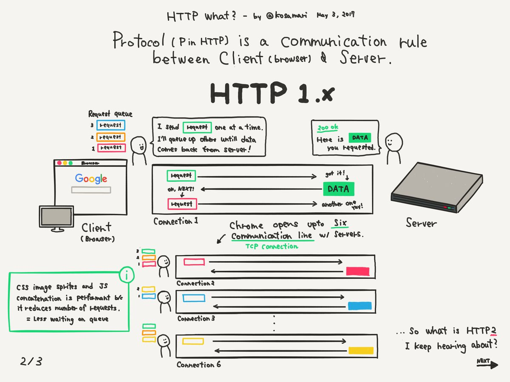

**HTTP/2** permite llevar varios intercambios en paralelo sobre **menos conexiones** (multiplexación) y comprimir cabeceras repetidas (**HPACK**, *HTTP/2 Header Compression*: esquema de compresión de cabeceras en HTTP/2), lo que suele notarse al cargar webs con muchos recursos.

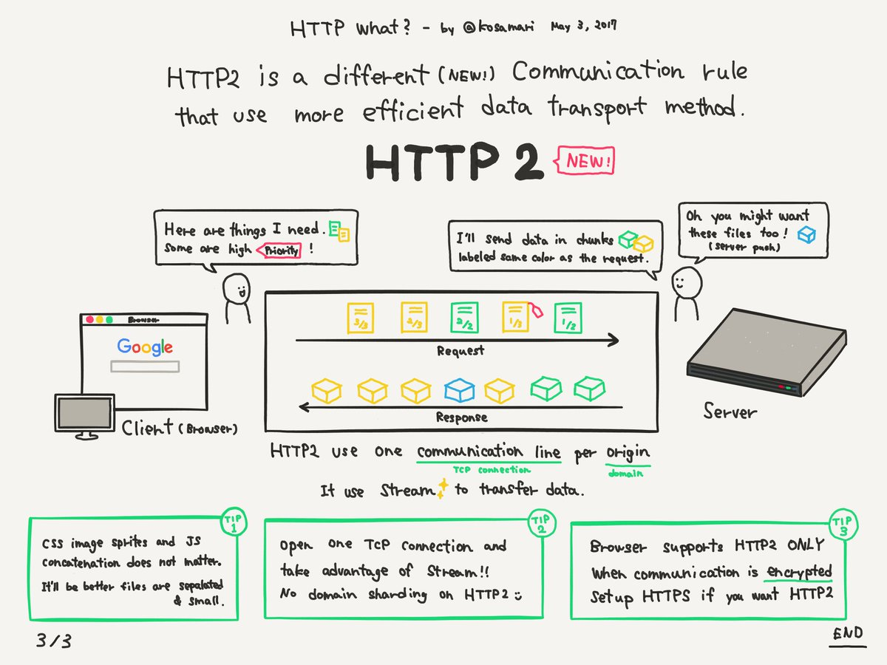

### Qué cambia (a alto nivel)

- **Multiplexación**: muchas “conversaciones” en paralelo sobre la misma conexión **TCP** (*Transmission Control Protocol*: transporte fiable entre dos hosts), con menos bloqueos.
- **Server push** (cuando está disponible): el servidor puede anticipar recursos.
- **Cabeceras comprimidas (HPACK)**: menos bytes repetidos.
- **Streams y priorización**: mejor control del orden/importancia de recursos.

### Recursos

- [Wikipedia | HTTP/2](https://es.wikipedia.org/wiki/HTTP/2)
- [Introducción a HTTP/2](https://developers.google.com/web/fundamentals/performance/http2/?hl=es)
- [¿Qué es HTTP/2 y qué ventajas tiene sobre HTTP 1.1?](https://somostechies.com/que-es-http2/#.W6uXIxMzZR4)
- [HTTP/2: así va a mejorar la velocidad de tu navegación sin que tú tengas que hacer nada](https://www.xataka.com/servicios/http-2-asi-va-a-mejorar-la-velocidad-de-tu-navegacion-sin-que-tu-tengas-que-hacer-nada)
- [HTTP/2 nuevo protocolo y cómo afecta al SEO](https://laculturadelmarketing.com/http2-y-como-afecta-al-seo/)
- [HTTP2, el nuevo Fast & Furious del protocolo](https://www.paradigmadigital.com/dev/http2-nuevo-fast-furious-del-protocolo/)

---

## ¿Cómo funciona el protocolo HTTP?

Lo que ves como “una llamada HTTP” en código o en DevTools es la **capa de aplicación**. Debajo, el sistema operativo ya ha resuelto el host (**DNS**), ha abierto (o reutilizado) **TCP** hacia el puerto adecuado y, si toca, ha negociado **TLS**: sin esa conexión de transporte no llega ningún `GET` ni ningún JSON.

### Especificación

Una **RFC** (*Request for Comments*) es un documento público del **IETF** (*Internet Engineering Task Force*) que describe cómo deben interoperar protocolos en Internet (no es un “comentario” informal: es el canal oficial de estandarización). La especificación clásica de HTTP es la **RFC 2616** (histórica). Hoy conviene pensar en el estándar moderno como **HTTP semántica** (familia de RFCs “911x”), pero la idea central sigue siendo la misma:

- [RFC 2616 (histórico)](https://tools.ietf.org/html/rfc2616#section-10)

No hace falta leer la RFC completa: sirve como referencia para que distintos programas (navegadores, APIs, proxies) interpreten **igual** métodos, cabeceras y códigos.

### Petición HTTP

Una petición suele incluir:

- **Método**: GET, POST, PUT/PATCH, DELETE…
- **URL**: esquema + host + path + querystring (p. ej. `https://api.ejemplo.com/v1/users?limit=10`)
- **Headers**: metadatos (p. ej. `Accept`, `Content-Type`, `Authorization`, `User-Agent`)
- **Body** (opcional): JSON, form-data, texto, binario…

En `https://api.ejemplo.com/v1/users?limit=10`, **`https://`** es el esquema (aquí, HTTP sobre **TLS**, *Transport Layer Security*), **`api.ejemplo.com`** el **host** (a qué máquina vas), **`/v1/users`** el **path** (qué recurso pides) y **`?limit=10`** la **querystring** (parámetros que el servidor usa como filtros, paginación u opciones).

Ejemplo de petición HTTP:

```http
GET /v1/users/42 HTTP/1.1
Host: api.ejemplo.com
Accept: application/json
Authorization: Bearer <token>
```

### Respuesta HTTP

Una respuesta suele incluir:

- **Status code**: 200, 404, 500…
- **Headers**
- **Body** (opcional): JSON, HTML, texto, binario…

Ejemplo de respuesta HTTP:

```http
HTTP/1.1 200 OK
Content-Type: application/json

{"id":42,"name":"Ada"}
```

### Métodos más usados

- **GET**: obtener recursos
- **POST**: crear o ejecutar una acción
- **PUT/PATCH**: actualizar (PUT reemplaza, PATCH modifica parcialmente)
- **DELETE**: eliminar

### HTTP y sus códigos (por familias)

Lista general:

- [Anexo: códigos de estado HTTP (Wikipedia)](https://es.wikipedia.org/wiki/Anexo:C%C3%B3digos_de_estado_HTTP)

Por tipología:

- **1xx**: informativas
- **2xx**: éxito (200 OK, 201 Created, 204 No Content…)
- **3xx**: redirecciones (301/302/307/308…)
- **4xx**: errores del cliente (400, 401, 403, 404, 409, 429…)
- **5xx**: errores del servidor (500, 502, 503…)

[HTTP cats - Una manera divertida de entender los códigos de estado HTTP](https://http.cat/)

**Cómo leerlos sin memorizarlos:** un **4xx** suele decir “revisa tu petición o tus permisos” (URL mal formada, recurso que no existe para esa ruta, token inválido, cuerpo JSON incorrecto…). Un **5xx** suele decir “el servidor (o algo de lo que depende) ha fallado o está saturado”; en cliente a veces solo puedes reintentar más tarde o informar del error, según la API.


---

## ¿Cómo funciona HTTPS (SSL/TLS)?

**HTTPS** (*HTTP Secure*) es HTTP “encima” de **TLS** (*Transport Layer Security*, capa de seguridad en el transporte). Eso ocurre **después** de que exista una **conexión TCP** con el servidor (normalmente al puerto **443**): primero TCP/IP lleva los bytes entre las dos máquinas; luego TLS cifra y autentica; encima va el HTTP. **SSL** (*Secure Sockets Layer*) es el nombre del estándar antiguo que TLS relevó; en títulos y productos aún verás “SSL/TLS”, pero en texto técnico actual lo normal es hablar de **TLS**.

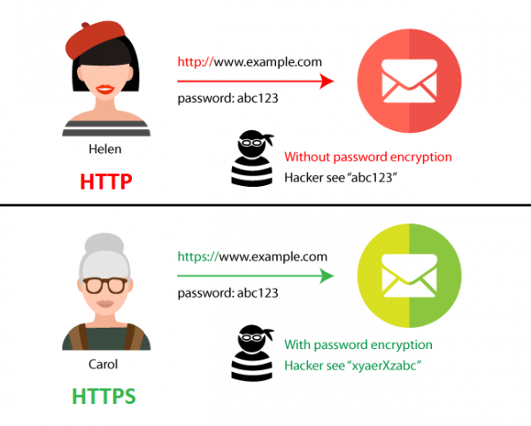

Puedes imaginarlo así: el **HTTP** es el mensaje de aplicación (método, ruta, cabeceras, cuerpo); **TLS** lo encapsula de forma que **por la red** viaja cifrado e íntegro. El **certificado** del servidor permite al cliente comprobar con quién está hablando y acordar claves; a partir de ahí, las peticiones y respuestas HTTP van **dentro** de ese “túnel” TLS (no debes asumir que el contenido es legible para terceros en tránsito).

TLS proporciona (idealmente):

- **Confidencialidad** (cifrado)
- **Integridad** (que no te lo manipulen en tránsito)
- **Autenticación del servidor** (certificado)


### Recursos

- [HakTip - How to Capture Packets with Wireshark - Getting Started](https://www.youtube.com/watch?v=6X5TwvGXHP0)
- [Are HTTP Websites Insecure?](http://blog.securitymetrics.com/2014/08/are-http-websites-insecure.html)
- [From July, Chrome will name and shame insecure HTTP websites](https://www.theregister.co.uk/2018/02/08/google_chrome_http_shame/)
- [Google Chrome: HTTPS or bust](https://www.theregister.co.uk/2018/07/23/https_dday_google_chrome/)
- [Steal My Login](http://www.stealmylogin.com/)
- [Firefox 59: mark HTTP as insecure](https://www.ghacks.net/2017/12/14/firefox-59-mark-http-as-insecure/)
