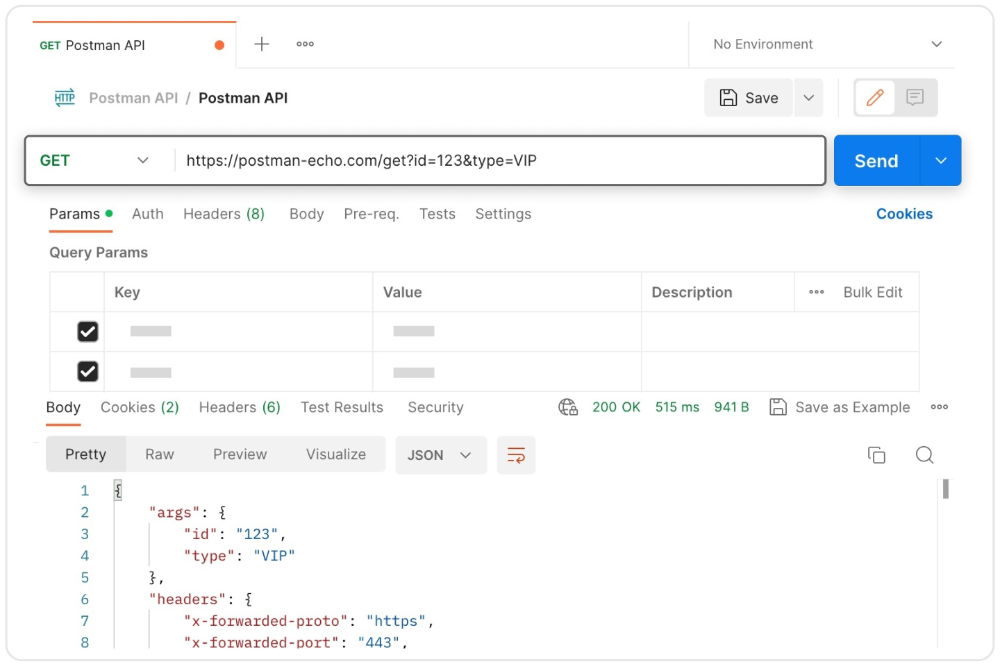

## Cliente REST: Postman


**Postman** es una herramienta para probar APIs sin escribir código. Recomendamos que aprendas a usarla para que puedas probar tus APIs y consumir APIs de terceros. Postman es una de las herramientas más usadas en el mundo del desarrollo software.

- [Postman](https://www.postman.com/)

Te dejamos algunos videos oficiales de Postman para que te familiarices con la herramienta:
- [Postman - Canal Oficial de YouTube](https://www.youtube.com/@postman/videos)
- [Postman - What is an API?](https://www.youtube.com/watch?v=-0MmWEYR2a8)
- [What Are API Endpoints? Explained in 4 Minutes](https://www.youtube.com/watch?v=JQyaOml1CV8)
- [REST API Fundamentals: Learn to Use GET, POST, PUT, & DELETE](https://www.youtube.com/watch?v=PfujVETI-i4)
- [Consuming REST APIs | Postman Enterprise](https://www.youtube.com/watch?v=oI-GyWB_6jA)
- [What Is a REST API? Learn the Basics Fast](https://www.youtube.com/watch?v=ohognl66H18)

Cuando creas tu cuenta, tienes la posibilidad de descargar la aplicación para tu sistema operativo. También puedes usar la aplicación en tu navegador, aunque para poder usar todas las funcionalidades, es mejor descargar la aplicación.

En Postman: elige el **método**, pega la **URL**, ajusta **Params** / **Headers** / **Body** si hace falta, pulsa **Send** y mira el **status** y el JSON de la respuesta.



| Pestaña | Para qué sirve |
|---------|----------------|
| **Params** | Query string (`?userId=1`) |
| **Headers** | Metadatos (`Content-Type`, `Accept`, …) |
| **Body** | Datos que envías (POST, PUT); en **raw → JSON** |

Si envías JSON en el body, añade el header `Content-Type: application/json`.

---

## Pruebas rápidas: GET, POST, PUT, DELETE

API de práctica: **[JSONPlaceholder](https://jsonplaceholder.typicode.com/guide/)**  
Base: `https://jsonplaceholder.typicode.com` — recurso **posts**.

> No persiste cambios; solo simula respuestas. Ideal para probar métodos HTTP.

### GET — leer

| Campo | Valor |
|-------|-------|
| URL | `https://jsonplaceholder.typicode.com/posts/1` |
| Query | — |
| Body | — |
| Respuesta | 200 → `id`, `userId`, `title`, `body` |

Listado: `GET` → `https://jsonplaceholder.typicode.com/posts`

Filtro por query (pestaña **Params**):

| Key | Value |
|-----|-------|
| `userId` | `1` |

URL resultante: `https://jsonplaceholder.typicode.com/posts?userId=1` → 200, array de posts de ese usuario.

---

### POST — crear

| Campo | Valor |
|-------|-------|
| URL | `https://jsonplaceholder.typicode.com/posts` |
| Headers | `Content-Type: application/json` |
| Body | raw → JSON |

```json
{
  "title": "Post desde Postman",
  "body": "Esto es una prueba",
  "userId": 1
}
```

**Respuesta:** 201, el JSON enviado + `"id": 101` (aprox.).

---

### PUT — actualizar

| Campo | Valor |
|-------|-------|
| URL | `https://jsonplaceholder.typicode.com/posts/1` |
| Headers | `Content-Type: application/json` |
| Body | raw → JSON |

```json
{
  "id": 1,
  "title": "Título actualizado",
  "body": "Cuerpo actualizado",
  "userId": 1
}
```

**Respuesta:** 200, devuelve el mismo objeto (no se guarda en el servidor).

---

### DELETE — borrar

| Campo | Valor |
|-------|-------|
| URL | `https://jsonplaceholder.typicode.com/posts/1` |
| Query / Body | — |

**Respuesta:** 200, body `{}`.

---

**Tip:** en la request, **Code** → *Python - Requests* genera el mismo ejemplo para llevarlo al notebook.
