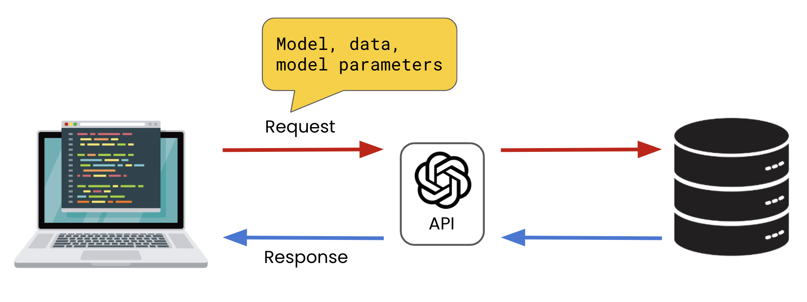
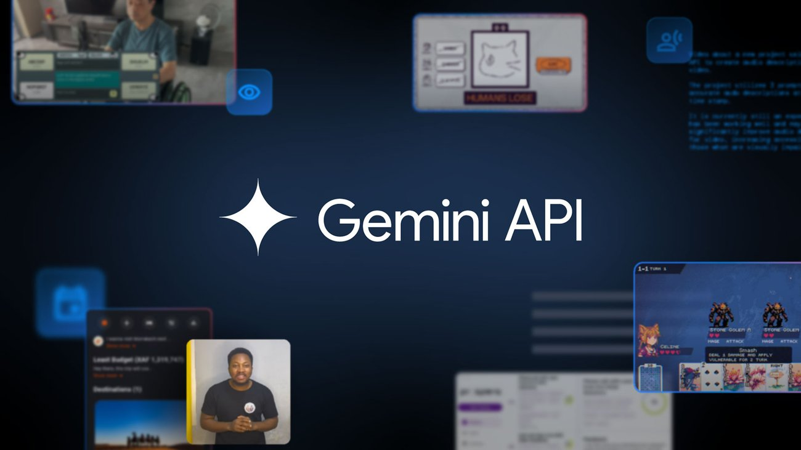

## IA generativa con Python (integración por API)

Aquí podrás encontrar teoría y ejemplos para familiarizarte con las **primeras integraciones** con un **modelo de lenguaje (LLM)** desde Python usando una **API**. 

### Objetivos
- Entender qué significa “consumir un LLM por API” desde Python.
- Aprender un patrón **agnóstico al proveedor** (válido para distintas compañías que ofrezcan API de LLMs).
- Controlar **inputs** (prompt) y **outputs** (texto vs JSON) para automatizar sin sorpresas.
- Construir **funciones reutilizables** para no repetir código.
- Ver ejemplos de integración con diferentes proveedores: Gemini, OpenAI, Anthropic, etc.

### Glosario
- **LLM**: “Large Language Model”. Un modelo que genera texto a partir de un contexto.
- **API**: interfaz para que un programa se comunique con un servicio por HTTP.
- **Endpoint**: una URL concreta a la que haces una petición (por ejemplo, `POST /v1/...`).
- **API key**: “llave” para autenticarte. Es un secreto.
- **Prompt**: instrucciones + datos que envías al modelo.
- **Output**: lo que devuelve (texto libre o un JSON que tú pides).

---

## 1) Panorama actual: proveedores y modelos (contexto)
Hay varios proveedores habituales para consumir LLMs por API. **No necesitas memorizar marcas**: lo importante es que casi todos comparten el mismo patrón:

Uso de HTTP:
- HTTP (normalmente `POST`)
- autenticación (API key)
- request/response en JSON
- (opcional) streaming (respuesta “en trozos”)

Proveedores habituales:

- **Google (Gemini)**: muy común en integraciones y fuerte en multimodalidad (texto + imagen, etc.). Doc: [Gemini API (Google AI for Developers)](https://ai.google.dev/gemini-api)
- **Anthropic (Claude)**: muy usado en asistentes y automatización de tareas de texto. Doc: [Anthropic API docs](https://docs.anthropic.com/)
- **OpenAI**: muy común en integraciones educativas y de producto. Doc: [OpenAI API docs](https://platform.openai.com/docs)
- **Azure OpenAI**: opción típica en entornos corporativos/regulados (misma idea de API, con gobernanza enterprise). Doc: [Azure OpenAI docs](https://learn.microsoft.com/azure/ai-services/openai/)
- **AWS Bedrock**: “plataforma” para consumir modelos de varios proveedores con una capa común. Doc: [Amazon Bedrock docs](https://docs.aws.amazon.com/bedrock/)
- **Mistral / Cohere / otros**: alternativas frecuentes según región, coste, o políticas de despliegue. Doc: [Mistral API docs](https://docs.mistral.ai/) · [Cohere API docs](https://docs.cohere.com/)
- **Open-source / open-weights** (vía servidores propios): opción cuando necesitas control total (pero suele requerir más infraestructura). Referencias: [Hugging Face Transformers](https://huggingface.co/docs/transformers/) · [vLLM](https://docs.vllm.ai/)

**Idea clave**: Aprenderás a construir un “cliente” que haga llamadas HTTP y procese JSON. Cambiar de proveedor suele ser cambiar:

- la URL del endpoint
- el nombre del modelo
- la forma exacta del JSON (payload/respuesta)
- La documentación de la API varía según el proveedor.

---

## 2) Llamadas a modelos de lenguaje vía API (idea general)
Independientemente del proveedor, normalmente harás:

1. Construir un **payload JSON** (modelo, mensajes/instrucciones, parámetros).
2. Enviar una petición HTTP (POST) con:
   - `Authorization: Bearer <API_KEY>` (o similar)
   - `Content-Type: application/json`
   - Este paso suele ser transparente para el usuario, ya que el objeto cliente se encarga de ello.
3. Recibir una **respuesta JSON** y extraer el contenido generado.



### 2.1) “API de un LLM” (qué significa)
Muchas veces se habla de “la API de X” (ChatGPT, Gemini, Claude…) de forma informal. A nivel técnico, lo que haces es llamar a la **API de un proveedor de LLMs**.

- ChatGPT/Gemini/Claude son **productos o modelos**.
- Una integración real usa **endpoints** del proveedor (por ejemplo “generate content / chat / responses…”, según proveedor).

No te preocupes por el nombre exacto del endpoint en este documento: quédate con el patrón **HTTP + JSON + API key**.

---

## 3) Configuración segura: API keys y entorno
### 3.1) Nunca hardcodear claves
- No pegues claves en `.py` ni en notebooks.
- Usa **variables de entorno** (ej. `GEMINI_API_KEY`, `GOOGLE_API_KEY`, etc.).
- Si usas `.env`, asegúrate de que está en `.gitignore`.

#### ¿Por qué es tan importante?
Porque una API key en un repo (aunque sea privado) es un riesgo real:

- alguien la puede copiar
- puedes tener costes inesperados
- puedes violar políticas de seguridad

### 3.2) Unificar configuración
Centraliza en un sitio:
- `BASE_URL` (si aplica)
- `API_KEY`
- `MODEL`
- `TIMEOUT`
- `RETRIES`

Esto facilita cambiar de proveedor sin tocar el resto del código.

---

## 4) Control de inputs (desde Python)
El input “real” de un LLM es el **contexto**. En integraciones, conviene separar:

- **Instrucciones**: qué debe hacer y cómo debe responder.
- **Datos**: el contenido a procesar (texto, lista, documento).

Buenas prácticas:
- **Limitar tamaño**: decide un máximo de caracteres/tokens del texto de entrada (por coste, rendimiento y límites del proveedor).
- **Normalizar**: recorta espacios, normaliza saltos de línea, elimina ruido.
- **Evitar ambigüedad**: instrucciones claras, requisitos explícitos.

### 4.1) Plantilla mental (prompt)
En automatización, funciona mejor algo como:

- “Devuelve solo JSON válido”
- “Estas son las claves exactas…”
- “Si no puedes, devuelve un JSON de error con…”

### 4.2) Ejemplo de prompt para automatizar (sin código)
Objetivo: extraer datos estructurados.

- **Instrucciones**:
  - “Devuelve exclusivamente JSON válido.”
  - “Claves: `resumen` (string), `keywords` (lista de strings), `idioma` (string).”
  - “No añadas explicaciones fuera del JSON.”
- **Datos**:
  - aquí pegas el texto a resumir

### 4.3) Ejemplo de prompt detallado para hacer peticiones a un LLM y obtener un JSON como respuesta (puedes hacer una prueba con este prompt directamente en chatgpt para probarlo)

Este prompt está pensado para que el modelo actúe como “asistente de investigación” y devuelva un listado de eventos en Madrid (idealmente con fuentes). 

```text
Rol: Eres un asistente que recopila y organiza información de eventos.
Tarea: Quiero un listado de eventos en Madrid durante el mes de mayo de {AÑO}.

Requisitos:
1) Devuelve EXCLUSIVAMENTE JSON válido (sin texto fuera del JSON).
2) Incluye solo eventos que ocurran en Madrid (ciudad o Comunidad de Madrid).
3) Fecha: del 1 al 31 de mayo de 2026. Si el evento dura varios días, incluye rango.
4) Incluye al menos 12 eventos distintos. Si no llegas a 12, devuelve los que encuentres y explica el motivo en el campo `warnings`.
5) Cada evento debe incluir fuente verificable (URL). Si no puedes encontrar URL fiable, NO incluyas el evento.
6) Variedad: intenta incluir al menos 3 categorías diferentes (música, exposiciones, teatro, deporte, festivales, conferencias, etc.).

Este es el formato de salida (JSON) que queremos obtener para cada evento:
{
  "query": {
    "city": "Madrid",
    "country": "ES",
    "month": "05",
    "year": {AÑO}
  },
  "events": [
    {
      "name": "string",
      "category": "string",
      "date_start": "YYYY-MM-DD",
      "date_end": "YYYY-MM-DD|null",
      "time": "string|null",
      "venue": "string|null",
      "address": "string|null",
      "price_eur": "number|null",
      "ticket_url": "string|null",
      "source_url": "string",
      "notes": "string|null"
    }
  ],
  "warnings": ["string"]
}

Reglas:
- No inventes eventos. Si dudas, exclúyelo.
- Normaliza fechas a ISO 8601.
- Si el precio no es claro, usa null.
- Si el evento no tiene web oficial, usa una fuente fiable (por ejemplo, web del recinto, promotor, institución cultural o agenda reconocida) y colócala en `source_url`.

Ahora genera el JSON para Año 2026.
```

  

---

## 5) Control de outputs: texto libre vs JSON
### 5.1) Texto libre
Útil para: redactar, resumir para lectura, brainstorming.
Problema: es difícil de integrar en un programa sin reglas.

### 5.2) JSON
Útil para: extracción, clasificación, normalización, pipelines.

Patrón:
- Pides JSON.
- Parseas JSON.
- Validación mínima (claves/tipos).
- Si falla, lo tratas como error (y opcionalmente reintentas).

#### ¿Por qué JSON?
Porque si el output lo vas a usar en tu programa (no solo leerlo), necesitas un formato:

- fácil de parsear
- fácil de validar
- fácil de guardar (fichero, base de datos)

---

## 6) Procesamiento de respuestas JSON en Python
En integraciones de APIs en general (incluyendo LLMs):

- `resp.raise_for_status()` para detectar 4xx/5xx.
- `resp.json()` para parsear la respuesta HTTP (si el body es JSON).

En el caso específico de “LLM → JSON”:
- A veces el body HTTP sí es JSON, pero el **texto generado** dentro trae otro JSON que tú pediste.
- Entonces harás `json.loads(generated_text)` y gestionarás errores de parseo.

Validación mínima recomendada:
- ¿es `dict`?
- ¿existen las claves esperadas?
- ¿los tipos encajan?

### 6.1) Dos JSON diferentes (muy importante)
En una integración típica puedes tener:

1. **JSON de transporte (HTTP)**: el proveedor responde con un JSON “envoltorio”.
2. **JSON generado por el modelo**: dentro del campo de texto, el modelo te devuelve otro JSON porque tú se lo pediste.

Es normal: el primero lo parseas con `resp.json()`; el segundo con `json.loads(...)`.

---

## 7) Manejo de errores (red, HTTP, rate limit)
Errores típicos cuando consumes APIs de LLMs:
- **Timeout** (la respuesta tarda).
- **HTTPError 401/403** (clave inválida, permisos).
- **HTTPError 429** (rate limit / demasiadas peticiones).
- **HTTPError 5xx** (problemas del proveedor).
- **RequestException** (DNS, conexión, TLS, etc.).

Buenas prácticas mínimas:
- Siempre usar `timeout`.
- Capturar `Timeout`, `HTTPError` y `RequestException`.
- Si hay 429, considerar reintento respetando `Retry-After` (si existe) + backoff.

### 7.1) Qué significa “rate limit” (429)
Si ves **429 Too Many Requests** significa: “has hecho demasiadas peticiones en poco tiempo”.

Qué hacer:
- esperar (si hay header `Retry-After`, úsalo)
- reintentar con pausa creciente (backoff)
- reducir concurrencia o frecuencia

---

#  Ejemplos con Python + API de LLMs

Existen en el mercado varios proveedores de API de IA generativa. En esta sección veremos ejemplos de integración con los siguientes proveedores:
- Gemini API (Google GenAI SDK)
- OpenAI API (OpenAI SDK)
- Anthropic API (Claude)

## Ejemplos con Python + Gemini API (Google GenAI SDK)



Estos ejemplos están pensados para que veas el flujo real: **API key → request → response → extraer texto / parsear JSON** usando Gemini desde Python.

- [Documentación de la API de Gemini](https://ai.google.dev/gemini-api/docs?hl=es-419)


También te recomendamos usar un ojo a Google AI Studio para ver los modelos disponibles y sus características: 

- [Google AI Studio](https://aistudio.google.com/welcome)

Te dejamos un vídeo de introducción a Google AI Studio:
- [Video | Introducción a Google AI Studio](https://www.youtube.com/watch?v=IHOJUJjZbzc)

Usaremos el SDK recomendado actualmente:
- **Paquete**: `google-genai`
- **Cliente**: `from google import genai` + `client = genai.Client()`

### Preparación (SDK + API key por variable de entorno)
Instalar dependencias:

```bash
pip install -U google-genai
```

Definir la variable de entorno `GEMINI_API_KEY` en el sistema (se recomienda no pegarla en el código).

En Windows (PowerShell):

```powershell
$env:GEMINI_API_KEY="TU_CLAVE_AQUI"
```

En macOS/Linux (bash/zsh):

```bash
export GEMINI_API_KEY="TU_CLAVE_AQUI"
```

> Nota: alternativamente puede usarse `GOOGLE_API_KEY`, pero es mejor estandarizar una sola (por ejemplo `GEMINI_API_KEY`).

### 1) Ejemplo — Texto libre
Este ejemplo devuelve texto (no JSON).

```python
from google import genai

# El cliente toma la API key de la env var GEMINI_API_KEY
client = genai.Client()

response = client.models.generate_content(
    model="gemini-3-flash-preview",
    contents="Resume en 3 frases qué es la IA generativa.",
)

print(response.text)
```

### 2) Ejemplo — Pedir JSON “como contrato” y parsearlo
Aquí queremos una salida estructurada para poder usarla en un programa.

```python
import json
from google import genai
from google.genai import types

client = genai.Client()

instructions = (
    "Devuelve EXCLUSIVAMENTE JSON válido. Sin texto fuera del JSON.\n"
    "Claves: resumen (string), keywords (lista de strings), idioma (string).\n"
)
text = "La IA generativa crea contenido nuevo (texto, imágenes, etc.) a partir de patrones aprendidos."

# Lanzar la petición a la API de Gemini con tu consulta para obtener un JSON como respuesta
response = client.models.generate_content(
    model="gemini-3-flash-preview",
    contents=f"{instructions}\n\nTEXTO:\n{text}",
    config=types.GenerateContentConfig(
        temperature=0,
        response_mime_type="application/json",
    ),
)

generated = (response.text or "").strip()

try:
    obj = json.loads(generated)
except json.JSONDecodeError as e:
    raise ValueError(f"El modelo NO devolvió JSON válido. Texto recibido: {generated!r}") from e

# Validación mínima
required = {"resumen", "keywords", "idioma"}
if not isinstance(obj, dict) or not required.issubset(obj):
    raise ValueError(f"JSON inesperado: {obj!r}")

print(obj)
```

---

## Ejemplos con Python + OpenAI API (OpenAI SDK)


- variable de entorno para la clave
- llamada para **texto**
- llamada pidiendo **JSON** (para automatización)
- (opcional) streaming

Documentación:
- [OpenAI API docs](https://platform.openai.com/docs)

### 1) Preparación (SDK + API key por variable de entorno)
Instalar dependencias:

```bash
pip install -U openai
```

Definir la variable de entorno `OPENAI_API_KEY` en el sistema (se recomienda no pegarla en el código).

En Windows (PowerShell):

```powershell
$env:OPENAI_API_KEY="TU_CLAVE_AQUI"
```

En macOS/Linux (bash/zsh):

```bash
export OPENAI_API_KEY="TU_CLAVE_AQUI"
```

### 2) Ejemplo — Texto libre

```python
from openai import OpenAI

client = OpenAI()  # Lee OPENAI_API_KEY desde variables de entorno

# Lanzar la petición a la API de OpenAI con tu consulta para obtener un texto como respuesta
resp = client.responses.create(
    model="gpt-4.1-mini",
    input="Resume en 3 frases qué es la IA generativa.",
)

print(resp.output_text)
```

### 3) Ejemplo — Pedir JSON “como contrato” y parsearlo
Aquí pedimos **solo JSON** para poder integrarlo en un pipeline. Después lo parseamos con `json.loads`.

```python
import json
from openai import OpenAI

client = OpenAI()

instructions = (
    "Devuelve EXCLUSIVAMENTE JSON válido. Sin texto fuera del JSON.\n"
    "Claves: resumen (string), keywords (lista de strings), idioma (string).\n"
)
text = "La IA generativa crea contenido nuevo (texto, imágenes, etc.) a partir de patrones aprendidos."

# Lanzar la petición a la API de OpenAI con tu consulta para obtener un JSON como respuesta
resp = client.responses.create(
    model="gpt-4.1-mini",
    input=f"{instructions}\n\nTEXTO:\n{text}",
)

generated = (resp.output_text or "").strip()

try:
    obj = json.loads(generated)
except json.JSONDecodeError as e:
    raise ValueError(f"El modelo NO devolvió JSON válido. Texto recibido: {generated!r}") from e

required = {"resumen", "keywords", "idioma"}
if not isinstance(obj, dict) or not required.issubset(obj):
    raise ValueError(f"JSON inesperado: {obj!r}")

print(obj)
```
---

## Ejemplo con Python + Anthropic (Claude)


La idea es que veas otro proveedor más y confirmes el patrón: **API key por entorno → request → extraer texto**.

Documentación:
- [Anthropic API docs](https://docs.anthropic.com/)

### 1) Preparación (SDK + API key por variable de entorno)
Instala dependencias:

```bash
pip install -U anthropic
```

Definir la variable de entorno `ANTHROPIC_API_KEY` en el sistema (se recomienda no pegarla en el código).

En Windows (PowerShell):

```powershell
$env:ANTHROPIC_API_KEY="TU_CLAVE_AQUI"
```

En macOS/Linux (bash/zsh):

```bash
export ANTHROPIC_API_KEY="TU_CLAVE_AQUI"
```

### 2) Ejemplo — Texto libre

```python
from anthropic import Anthropic

client = Anthropic()  # Lee ANTHROPIC_API_KEY desde variables de entorno

# Lanzar la petición a la API de Anthropic con tu consulta para obtener un texto como respuesta
msg = client.messages.create(
    model="claude-3-5-sonnet-latest",
    max_tokens=200,
    messages=[
        {"role": "user", "content": "Resume en 3 frases qué es la IA generativa."}
    ],
)

print(msg.content[0].text)
```