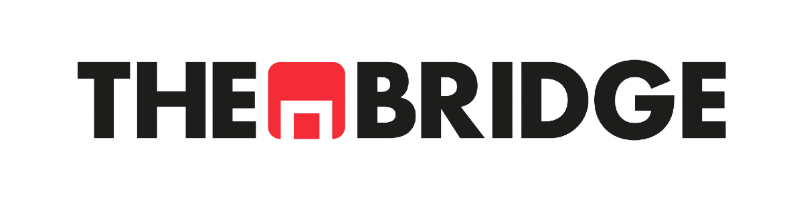

- [**Descripción**](#descripción)
- [**Antes de empezar: Sprint_00**](#antes-de-empezar-sprint_00)
- [**Requisitos previos**](#requisitos-previos)
- [**Cómo funciona el curso**](#cómo-funciona-el-curso)
- [**Estructura de los Sprints**](#estructura-de-los-sprints)
- [**Comentarios y Aclaraciones**](#comentarios-y-aclaraciones)
- [**Clonar y Actualizar Repositorio con Git Bash**](#clonar-y-actualizar-repositorio-con-git-bash)

## **Descripción**

Bienvenid@s al repositorio principal del Bootcamp Online de AI Engineering de The Bridge.

El repositorio se divide en los siguientes módulos principales:

1. Python + IA Generativa
2. Prompt & Context Engineering
3. Arquitecturas y Modelos de IA
4. RAG Engineering
5. AI Agents Engineering
6. MLOps para IA Generativa

¡Comenzamos!

## **Antes de empezar: Sprint_00**

El **Sprint_00** es el punto de partida del bootcamp. No sigue la estructura habitual de Unidades, sino que contiene guías de configuración del entorno que deberás revisar antes de la primera sesión:

- Uso de **Git** y clonado del repositorio
- Configuración de **VSCode** y **GitHub Codespaces**
- Uso de **Google Colab**
- Introducción a **Jupyter Notebooks** y Markdown

📌 Si es tu primera vez con alguna de estas herramientas, empieza aquí.

## **Requisitos previos**

Para seguir el bootcamp necesitarás tener instalado:

- **Python 3.10+**
- **Git**
- Un editor de código — recomendamos **VSCode**
- **Jupyter Notebook** y acceso a **Google Colab**

Las guías de instalación y configuración están disponibles en el Sprint_00.

## **Cómo funciona el curso**

El bootcamp se organiza en **Sprints semanales**. Cada miércoles se abre un nuevo Sprint en el Campus Virtual, que corresponde al trabajo de la semana siguiente.

Cada Sprint contiene varias **Unidades temáticas**. Cada Unidad se compone de los siguientes elementos:

- 📖 **Teoría** — Material de referencia para estudiar el contenido del tema.
- 🏋️ **Workout** — Ejercicios prácticos que se realizan de forma guiada desde el Campus Virtual, acompañados de un vídeo explicativo. Son el núcleo del aprendizaje autónomo antes de la Live Review.
- 📝 **Ejercicios Workout** *(opcionales)* — Ejercicios adicionales para afianzar lo trabajado en el Workout a tu propio ritmo.
- 🎥 **Live Review (LR)** — Sesión en vivo donde se repasan y profundizan los conceptos de la Unidad. Por Sprint se celebran **2 Live Reviews**.
- 🤝 **Team Challenge (TC)** — Sesión en vivo con formato variable: a veces trabajaréis en grupo, otras ampliaremos conocimientos y otras dedicaremos el tiempo a practicar.
- ✅ **Práctica Obligatoria** — Ejercicio de consolidación que recomendamos completar antes de asistir a la Live Review correspondiente.

> **¿No puedes asistir a una sesión?** No te preocupes. Las grabaciones se subirán al Campus Virtual en cuanto estén listas.

## **Estructura de los Sprints**

Dentro de cada Sprint encontrarás carpetas organizadas por Unidades. A su vez, cada Unidad puede contener las siguientes subcarpetas:

| Carpeta | Descripción |
|---|---|
| `Ejercicios_Warmup` | En algunos casos. Ejercicios de calentamiento para repasar conceptos previos antes de entrar en materia. |
| `Teoria` | Notebooks explicativos con la teoría del tema. Material de referencia para estudiar el contenido. |
| `Workout` | Notebooks del Workout. Se realizan desde el Campus acompañados de un vídeo explicativo para aprender el contenido antes de la Live Review. |
| `Ejercicios_Workout` | *(Opcionales)* Ejercicios adicionales para afianzar lo aprendido en el Workout. |
| `Practica_Obligatoria` | Práctica obligatoria. Se recomienda completarla antes de asistir a la Live Review correspondiente. |
| `Live_Session` | En algunos casos. Tendrá la misma función que _Práctica obligatoria_ en algunas _Unidad 3_s. |

## **Comentarios y Aclaraciones**

El repositorio se irá actualizando a medida que avancemos en el Bootcamp, incorporando los materiales de los diferentes módulos, agrupados en Sprints y Live Reviews.

Siguiendo esta filosofía, los Sprints se abrirán de forma sincronizada con el Campus Virtual, según las fechas de apertura indicadas en el calendario del Bootcamp.

## **Clonar y Actualizar Repositorio con Git Bash**

### Opción A — Clonar

Con `git clone` te descargas una copia local del repositorio vinculada al original. Puedes hacer `git pull` en cualquier momento para recibir las actualizaciones que vayamos subiendo.

1. Moverse a la carpeta local en la que deseamos clonar el repo. Por ejemplo:  
`cd Documents/Repositorios_curso`

2. Abrir Git Bash en ese directorio.

3. Clonar el repositorio:  
`git clone https://github.com/aie-online-tb/AIE-Online.git`

4. Para obtener las últimas actualizaciones:  
`git pull`

### Opción B — Fork 

Un **fork** crea una copia completa del repositorio en tu propia cuenta de GitHub. Esto te permite hacer `git push` de tus ejercicios y cambios a tu fork personal sin afectar al repositorio original.

Para hacer un fork:

1. Pulsa el botón **Fork** en la esquina superior derecha de la página del repositorio en GitHub.
2. Clona tu fork (no el original) en local:  
`git clone https://github.com/TU_USUARIO/AIE-Online.git`
3. Para recibir las actualizaciones del repo original, añádelo como remoto adicional:  
`git remote add upstream https://github.com/aie-online-tb/AIE-Online.git`
4. Y cuando haya novedades, sincroniza:  
`git pull upstream main`

> **En resumen:** usa **clone** si solo quieres seguir el material; usa **fork** si además quieres versionar tus propias soluciones y ejercicios.
